# [React](https://overreacted.io/react-as-a-ui-runtime)

Декларативное описание UI. Нет необходимости императивно описывать, что нужно сделать,
вместо этого описывается новое состояние UI, а React благодаря Reconciliation сделает всё сам)

## Термины
### Host Tree
React programs usually output a tree that may change over time.
It might be a DOM tree, aniOS hierarchy, a tree of PDF primitives, or even of JSON objects.
However, usually, we want to represent some UI with it. We’ll call it a “host tree” because 
it is a part of the host environment outside of React — like DOM or iOS.
The host tree usually has its own imperative API. React is a layer on top of it.

### Host Instances
The host tree consists of nodes. We’ll call them “host instances”. 
In the DOM environment, host instances are regular DOM nodes — like the objects you get
when you call document.createElement('div'). 

### Renderers
A renderer teaches React to talk to a specific host environment and manage its host instances.
React DOM, React Native, and even Ink are React renderers.

### React Elements
In the host environment, a host instance (like a DOM node) is the smallest building block.
In React, the smallest building block is a React element.
A React element is a plain **JavaScript object**.

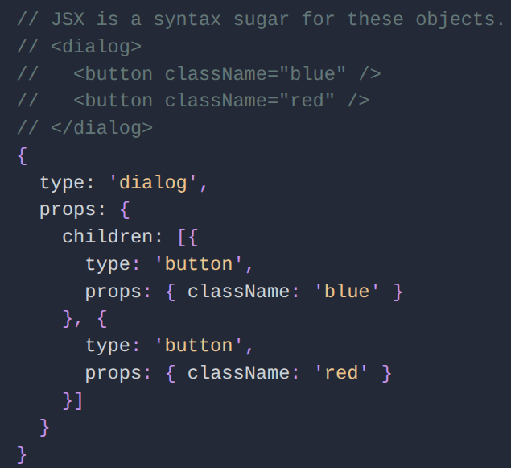

A React element is lightweight and has no host instance tied to it.

Remember that React elements don’t have their own persistent identity.
They’re meant to be re-created and thrown away all the time.

React elements are immutable. For example, you can’t change the children or a property of a React element.
If you want to render something different later, you will describe it with a new React element tree created from scratch.

I like to think of React elements as being like frames in a movie.
They capture what the UI should look like at a specific point in time. They don’t change.

### Entry Point
React DOM entry point is `ReactDOM.render`

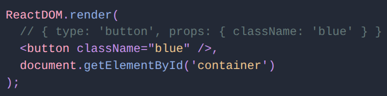

When we say ReactDOM.render(reactElement, domContainer),
we mean: “Dear React, make the domContainer host tree match my reactElement.”

React will look at the reactElement.type (in our example, 'button') and
ask the React DOM renderer to create a host instance for it and set the properties:

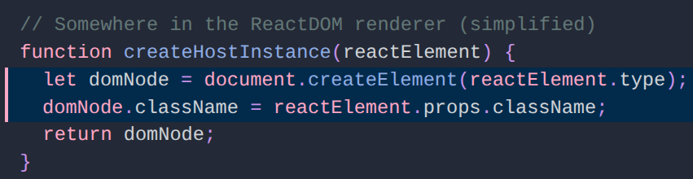

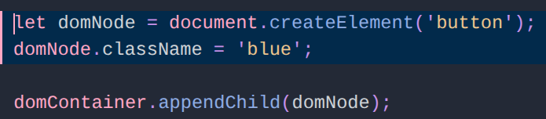

If the React element has child elements in reactElement.props.children,
React will recursively create host instances for them too on the first render.

## Reconciliation (Согласование)
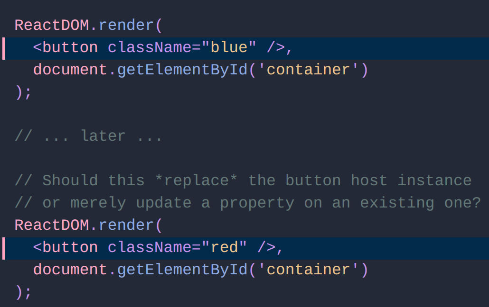

React’s job is to make the host tree match the provided React element tree.
The process of figuring out what to do to the host instance tree in response to new information
is sometimes called reconciliation.

When a component’s props or state change, React decides whether an actual DOM update is necessary
by comparing the newly returned element with the previously rendered one.
When they are not equal, React will update the DOM. This process is called “reconciliation”.

Простой путь

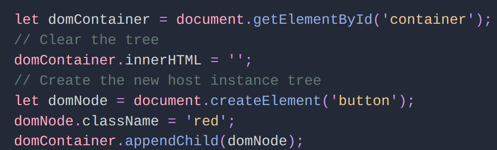

But in DOM, this is slow and loses important information like focus, selection, scroll state, and so on.
Instead, we want React to do something like this:

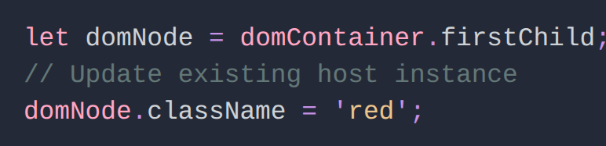

This raises a question of identity. The React element may be different every time,
but when does it refer to the same host instance conceptually?

If an element type in the same place in the tree “matches up” between the previous and the next renders,
React reuses the existing host instance.

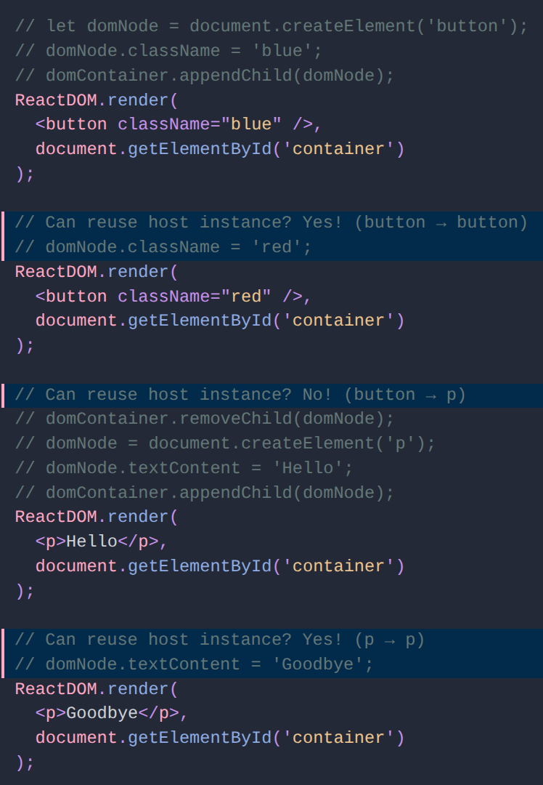

The same heuristic is used for child trees. For example, when we update a <dialog> with two <button>s inside,
React first decides whether to re-use the <dialog>, and then repeats this decision procedure for each child.

### Conditions

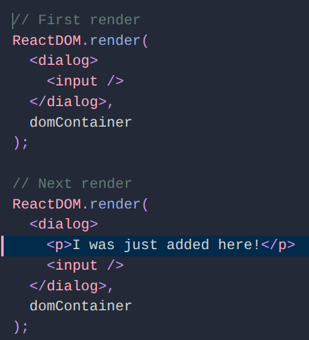

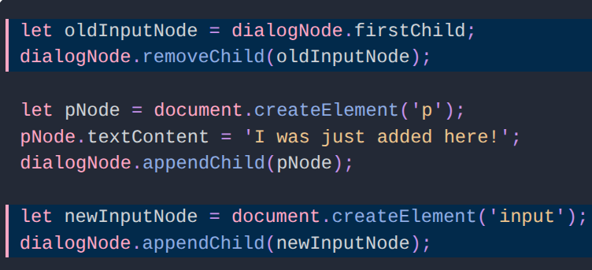

This is not great because conceptually the `<input>` hasn’t been replaced with `
` — it just moved.
We don’t want to lose its selection, focus state, and content due to re-creating the DOM.

In practice, you would rarely call ReactDOM.render directly.
Instead, React apps tend to be broken down into functions like this:

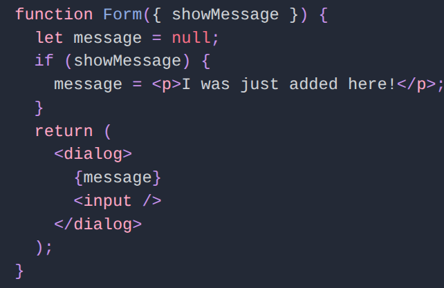

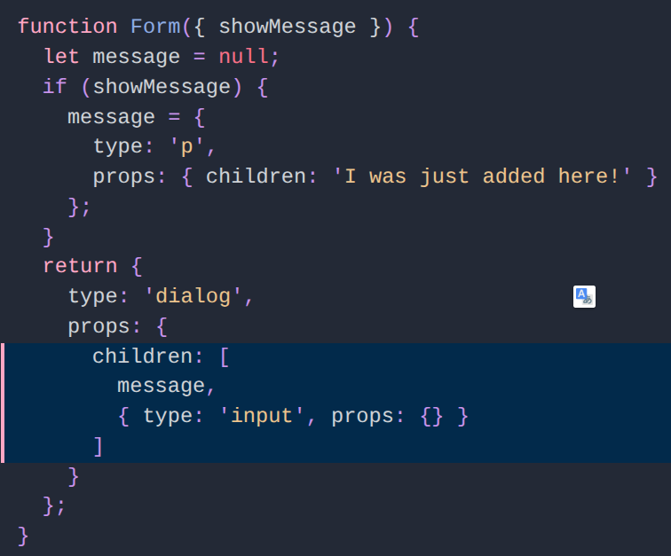

Regardless of whether showMessage is true or false,
the `<input>` is the second child and doesn’t change its tree position between renders.

### Lists
With dynamic lists, we can’t be sure the order is ever the same:

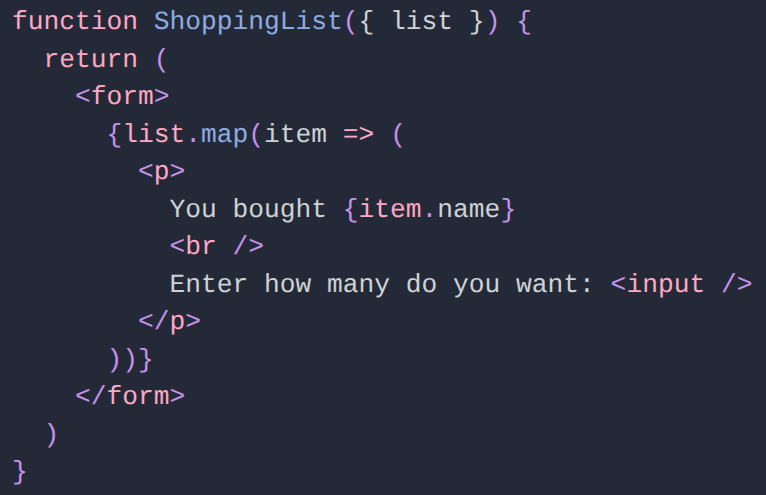

If the list of our shopping items is ever re-ordered,
React will see that all p and input elements inside have the same type,
and won’t know to move them. (From React’s point of view, the items themselves changed, not their order.)

So instead of re-ordering them, React would effectively update each of them.
This can create performance issues and possible bugs.
For example, the content of the first input would stay reflected in first input after the sort
— even though conceptually they might refer to different products in your shopping list!

This is why React nags you to specify a special property called key every time you include an array of elements in your output.

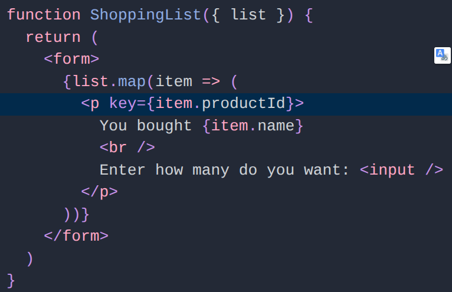

A key tells React that it should consider an item to be conceptually the same
even if it has different positions inside its parent element between renders.

When React sees `
` inside a `<form>`, it will check if the previous render also contained `
` inside the same `<form>`.
This works even if <form> children changed their order. React will reuse the previous host instance with the same key if it exists,
and re-order the siblings accordingly.

## Components

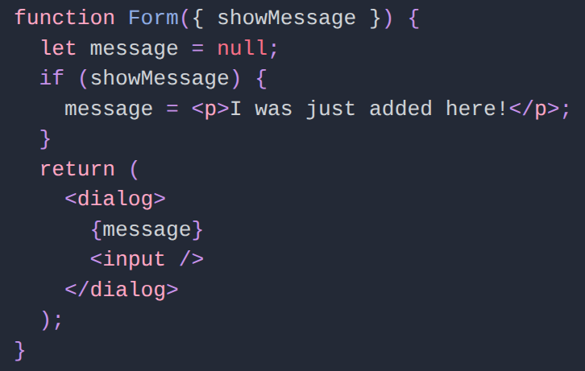

### Recursion

How do we use components from other components? Components are functions so we could call them:

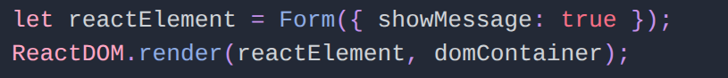

However, this is not the idiomatic way to use components in the React runtime.

Instead, the idiomatic way to use a component is with the same mechanism we’ve already seen before — React elements.

**This means that you don’t directly call the component function, but instead let React later do it for you:**

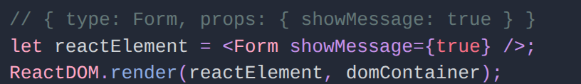

And somewhere inside React, your component will be called:

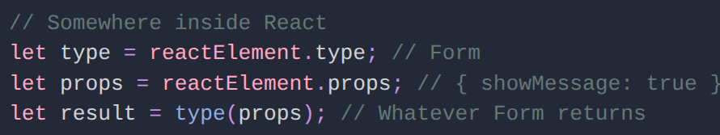

Okay, so what does React do when an element type is a function?

**It calls your component, and asks what element that component wants to render.**

This process continues recursively.

You: `ReactDOM.render(<App />, domContainer)`
React: Hey `App`, what do you render to?
App: I render `<Layout>` with `<Content>` inside.
React: Hey `Layout`, what do you render to?
Layout: I render my children in a `
`. My child was `<Content>` so I guess that goes into the `
`.
React: Hey `<Content>`, what do you render to?
Content: I render an `<article>` with some text and a `<Footer>` inside.
React: Hey `<Footer>`, what do you render to?
Footer: I render a `<footer>` with some more text.
React: Okay, here you go:

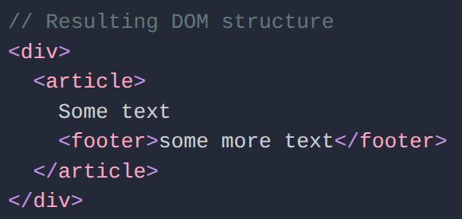

This is why we say reconciliation is recursive. When React walks the element tree,
it might meet an element whose type is a component. It will call it and keep descending down the tree of returned React elements.
Eventually, we’ll run out of components, and React will know what to change in the host tree.

The same reconciliation rules we already discussed apply here too.
If the type at the same position (as determined by index and optional key) changes,
React will throw away the host instances inside, and re-create them.

### Inversion of Control

You might be wondering: why don’t we just call components directly? Why write `<Form />` rather than `Form()`?

**React can do its job better if it “knows” about your components rather than
if it only sees the React element tree after recursively calling them.**

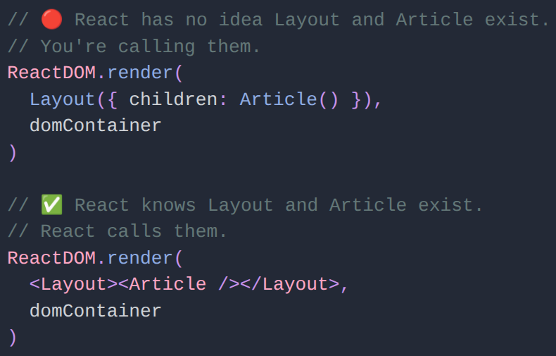

This is a classic example of [inversion of control](https://en.wikipedia.org/wiki/Inversion_of_control).
There’s a few interesting properties we get by letting React take control of calling our components:

- **Components become more than functions.** 
  React can augment component functions with features like local state that are tied to the component identity in the tree.
  If you called components directly, you’d have to build these features yourself.

- **Component types participate in the reconciliation.** 
  By letting React call your components, you also tell it more about the conceptual structure of your tree.
  For example, when you move from rendering `<Feed>` to the `<Profile>` page, React won’t attempt to re-use host instances inside them
  — just like when you replace `<button>` with a `
`. All state will be gone — which is usually good when you render a conceptually different view.

- **React can delay the reconciliation.**
  If React takes control over calling our components, it can do many interesting things. For example,
  it can let the browser do some work between the component calls so that re-rendering a large component tree doesn’t block the main thread.

- **A better debugging story.** 
  If components are first-class citizens that the library is aware of, we can build rich developer tools for introspection in development.